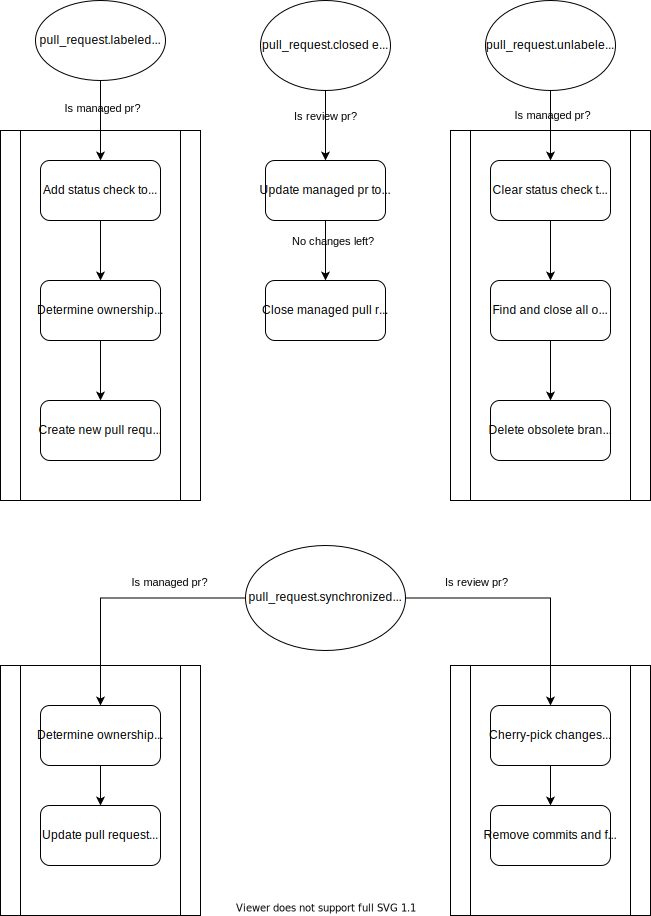

# rezensent

The rezensent (german for reviewer) is a github app which help managing big pull requests in a
repository divided by code ownership rules.

## Idea

Split a pull request into several smaller ones along the lines of ownership.
Then maintain the spitted pull requests using the app.

It is loosely based on the idea of [googles rosie](https://cacm.acm.org/magazines/2016/7/204032-why-google-stores-billions-of-lines-of-code-in-a-single-repository/fulltext)

> With Rosie, developers create a large patch, either through a find-and-replace
> operation across the entire repository or through more complex refactoring
> tools. Rosie then takes care of splitting the large patch into smaller
> patches, testing them independently, sending them out for code review, and
> committing them automatically once they pass tests and a code review. Rosie
> splits patches along project directory lines, relying on the code-ownership
> hierarchy described earlier to send patches to the appropriate reviewers

## How it works

  

